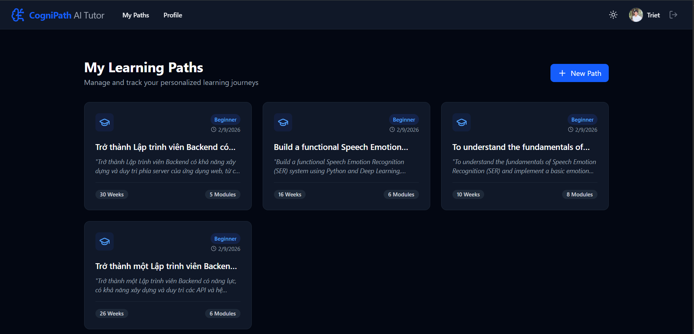

  

# 🚀 CogniPath - Personalized AI-Driven Learning Journey

CogniPath is an innovative EdTech startup project designed to revolutionize how students master new subjects. By leveraging the power of Generative AI and Multi-agent systems, CogniPath creates dynamic, personalized learning roadmaps tailored to each user's unique goals and background.

  

## ✨ Key Features
**AI-Generated Roadmaps**: Instantly create structured learning paths for any topic using Gemini Pro 3.0.

**Context-Aware Tutor**: Chat with an AI assistant that understands your specific learning module and uploaded materials.

**Multi-Source Integration**: Support for PDF, DOCX, and Google Drive file uploads to enhance the learning context.

**Dynamic UI**: A modern, resizable split-pane interface for seamless switching between content reading and AI interaction.

**Enterprise-Grade Deployment**: Scalable architecture hosted on Google Cloud Run and Firebase.

## 🛠️ Tech Stack
**Frontend**: ReactJS, Vite, Tailwind CSS, Lucide Icons.

**Backend**: Python, Flask, Gunicorn.

**AI Engine**: Google Generative AI (Gemini API).

**Cloud & Infrastructure**:

**Authentication & Hosting**: Firebase.

**Serverless Execution**: Google Cloud Run.

**APIs**: Google Picker API, Google Drive API.

## 🚀 Getting Started
### 1. Prerequisites
Node.js (v18+)

Python 3.9+

Google Cloud Project with billing enabled (Blaze plan).

### 2. Installation
Bash
**Clone the repository**
git clone https://github.com/your-username/cognipath.git
cd cognipath

**Setup Frontend**
cd client && npm install

**Setup Backend**
cd ../server
python -m venv venv
source venv/bin/activate  # On Windows: venv\Scripts\activate
pip install -r requirements.txt

### 3. Environment Variables
Create a .env file in both client/ and server/ directories. Refer to .env.example for the required keys:

**GOOGLE_API_KEY**: Your Gemini API Key.

**VITE_GOOGLE_CLIENT_ID**: OAuth 2.0 Client ID for Drive integration.

## 🌍 Deployment
This project is optimized for the Google Cloud Ecosystem:

**Backend**: Containerized via Docker and deployed to Cloud Run.

**Frontend**: Built with Vite and served via Firebase Hosting.

## 👨‍💻 Author
**Minh Triet Nguyen** Chapter Lead, GDGoC FPT University HCMC

AI Student @ FPT University

[def]: image.png