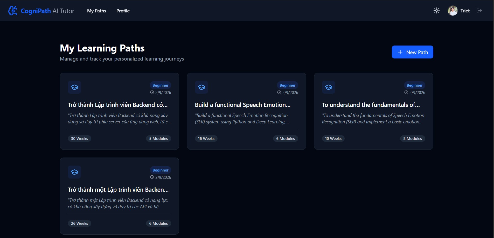

<p align="center">
  
</p>

# 🚀 CogniPath - Personalized AI-Driven Learning Journey

CogniPath is an innovative EdTech startup project designed to revolutionize how students master new subjects. By leveraging the power of Generative AI and Multi-agent systems, CogniPath creates dynamic, personalized learning roadmaps tailored to each user's unique goals and background.

<p align="center">
  
</p>

## ✨ Key Capabilities
- **🧠 Intelligent Roadmap Architect**: Instantly generates structured curricula tailored to specific user goals and current knowledge levels.
- **💬 Socratic AI Tutor**: A context-aware assistant that understands both the lesson content and the user's uploaded source materials.
- **📂 Multimodal Context Integration**: Native support for PDF, DOCX, and Google Drive for a truly document-grounded learning experience.
- **🎨 Premium UI/UX**: A modern, glassmorphic split-pane workspace designed for deep focus and seamless interaction.

---

## 🧭 "Kim Chỉ Nam" - Documentation Hub
We maintain a strict "Source of Truth" for every aspect of the project:

- [ ] **[Workflows Master](docs/Workflows_Master.md)**: Detailed business logic and technical flows.
- [ ] **[Schema Dictionary](docs/Schema_Dictionary.md)**: Standardized data models across Full-stack.
- [ ] **[Project Structure](docs/Project_Structure.md)**: Architectural map of the codebase.
- [ ] **[User Guide](docs/User_Guide.md)**: Comprehensive manual for end-users.

---

## 🏗️ System Architecture
CogniPath is built on a scalable, modular architecture optimized for production:

- **Frontend**: High-performance SPA built with **React & Vite**, styled with **Tailwind CSS**.
- **Backend**: **Python Flask** API serving as the orchestration layer for AI services.
- **AI Engine**: Powered by **Google Gemini API** for reasoning and content generation.
- **Persistence**: **Firestore** for real-time document sync and **Firebase Auth** for identity.
- **Deployment**: Containerized via **Docker** and hosted on **Google Cloud Run**.

---

## 📂 Project Structure
A high-level overview of how CogniPath is organized:

```text
cognipath_lms/
├── client/           # Frontend: React, Vite, Tailwind CSS
│   ├── src/api/      # API configurations
│   ├── src/hooks/    # Core business logic (Gemini, Upload)
│   └── src/pages/    # Main UI views (Workspace, Dashboard)
├── server/           # Backend: Python Flask, Gemini SDK
│   ├── app/routes/   # API endpoints definition
│   └── app/services/ # AI processing & logic layer
├── docs/             # "Kim Chỉ Nam" (Source of Truth docs)
├── assets/           # Project visuals & logos
└── firebase.json     # Hosting & Infrastructure config
```
*For a detailed breakdown, see [Project_Structure.md](docs/Project_Structure.md).*

---

## 🛠️ Technical Setup

### 1. Prerequisites
- Node.js (v18+) & Python 3.9+
- Google Cloud Project with Gemini API access.

### 2. Quick Installation
```bash
# Clone the repository
git clone https://github.com/your-username/cognipath.git
cd cognipath

# Setup Frontend
cd client && npm install

# Setup Backend
cd ../server
python -m venv venv
source venv/bin/activate # Windows: venv\Scripts\activate
pip install -r requirements.txt
```

### 3. Environment Config
Create `.env` files in both `client/` and `server/` following the standards in `Schema_Dictionary.md`.

---

## 📅 Future Roadmap: CogniPath NextGen
We are currently in the process of upgrading to a **Multimodal Agentic RAG** architecture:
- [ ] Transition to **Next.js 14 (App Router)** & **FastAPI**.
- [ ] Implementation of **Qdrant Vector Database** for large-scale document retrieval.
- [ ] **Multi-Agent Specialist System** (Researcher, Ingestor, Planner).
- [ ] See full [NextGen Implementation Plan](docs/Implementation_Plan_NextGen.md).

---

## 👨‍💻 Core Team
**Minh Triet Nguyen**  
*Chapter Lead, GDGoC FPT University HCMC*  
*AI Student @ FPT University*

---
<p align="center">© 2026 CogniPath Project - Built with "Premium & WOW" Philosophy</p>