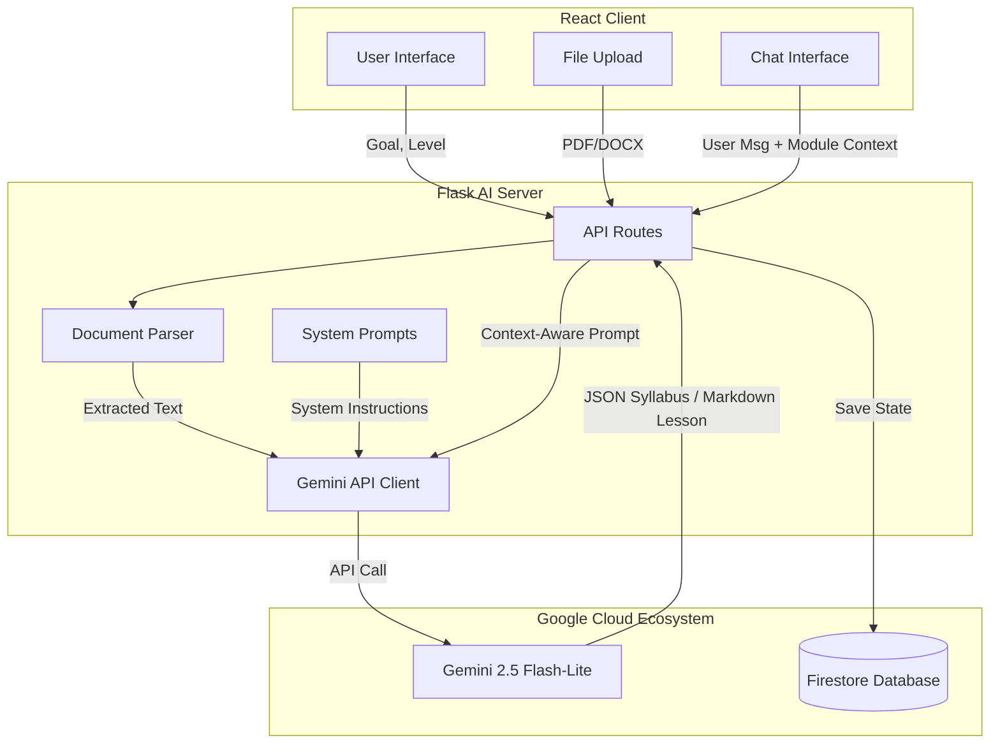

<p align="center">
  
</p>

# 🚀 CogniPath - Personalized AI-Driven Learning Journey (Production-Ready)

CogniPath is an enterprise-grade EdTech platform that leverages Generative AI and context-aware systems to revolutionize how students master new subjects. By deeply integrating Google's Gemini models, CogniPath dynamically generates personalized learning roadmaps tailored to each user's unique goals, background, and uploaded reference materials.

<p align="center">
  
</p>

## ✨ Key Features

- **AI-Generated Roadmaps**: Instantly creates structured, multi-module learning paths.
- **Context-Aware Socratic Tutor**: An integrated ChatBot that answers questions based on the specific lesson you are learning.
- **Multi-Source Context Integration**: Support for PDF, DOCX, and Google Drive file uploads.
- **Dynamic Split-Pane UI**: A modern, resizable interface for seamless switching between reading content and interacting with the tutor.

---

## 🧠 AI Engineering Architecture & LLMOps

CogniPath is built not just as a web application, but as a robust AI orchestration platform.

### System Data Flow


```mermaid
graph TD
    subgraph Frontend [React Client]
        UI[User Interface]
        Upload[File Upload]
        Chat[Chat Interface]
    end

    subgraph Backend [Flask AI Server]
        API[API Routes]
        Parser[Document Parser]
        Prompts[System Prompts]
        Gemini[Gemini API Client]
    end
    
    subgraph Cloud [Google Cloud Ecosystem]
        LLM[Gemini 2.5 Flash-Lite]
        DB[(Firestore Database)]
    end

    UI --> |Goal, Level| API
    Upload --> |PDF/DOCX| API
    API --> Parser
    Parser --> |Extracted Text| Gemini
    Prompts --> |System Instructions| Gemini
    Gemini --> |API Call| LLM
    LLM --> |JSON Syllabus / Markdown Lesson| API
    API --> |Save State| DB
    Chat --> |User Msg + Module Context| API
    API --> |Context-Aware Prompt| Gemini
```

### 1. Data Pipeline & Context Management (In-Memory RAG)
Instead of relying on a heavy Vector Database for simple document grounding, CogniPath employs a **Direct Context Injection (In-Memory RAG)** strategy:
- **Document Parsing**: Uploaded PDF and DOCX files are parsed server-side (using `pypdf` and `python-docx`).
- **Context Truncation**: Extracted text is safely truncated before being injected into the LLM's context window to prevent `TokenLimitExceeded` exceptions while ensuring maximum relevant context is maintained.
- **Stateless AI Processing**: Uploaded documents are processed in-memory. We **do not** persist raw user documents to disk or database, ensuring strict Data Privacy compliance.

### 2. Large Language Model (LLM) Strategy
We utilize Google's **Gemini 2.5 Flash-Lite** (`gemini-2.5-flash-lite`) via the `google-genai` SDK for both reasoning and chat.
- **Why Flash-Lite?**: It offers the perfect balance of low-latency generation (crucial for real-time Chat and Syllabus generation) and cost-efficiency, while still possessing strong logical reasoning capabilities.
- **Generation Configurations**: 
  - Lesson Generation operates at `temperature=0.7` to balance creativity with factual accuracy.
  - Path Generation strictly enforces a JSON Schema via `response_schema` to guarantee reliable UI rendering without parsing errors.

### 3. Prompt Engineering & Orchestration
The system utilizes centralized prompt templates (`app/prompts/system_prompts.py`) and specific injection techniques:
- **Hierarchical Context Injection**: When a user chats with the AI, the backend dynamically injects both the **Global Context** (the entire Path Syllabus) and the **Local Context** (the specific Module Content). This strictly grounds the AI, drastically reducing hallucinations.
- **Feedback-Loop Regeneration**: Users can pass specific feedback arrays to the backend, which are injected as "Urgent System Adjustments" into a regeneration prompt, allowing iterative refinement of lesson content.

---

## 🏗️ Tech Stack

- **Frontend**: ReactJS, Vite, TypeScript, Tailwind CSS, Lucide Icons.
- **Backend**: Python 3.9+, Flask, Gunicorn, `google-genai`.
- **Database**: Firebase Firestore (Document-Subcollection pattern for Paths > Modules > Messages).
- **Authentication**: Firebase Authentication (Google OAuth).
- **Cloud Infrastructure**: Firebase Hosting (Client) & Google Cloud Run (Server).

## 🚀 Getting Started

### 1. Prerequisites
- Node.js (v18+)
- Python 3.9+
- Google Cloud Project with billing enabled (Blaze plan required for Cloud Run).
- A valid Google Gemini API Key.

### 2. Installation

**Clone the repository**
```bash
git clone https://github.com/your-username/cognipath.git
cd cognipath
```

**Setup Frontend**
```bash
cd client
npm install
```

**Setup Backend**
```bash
cd ../server
python -m venv venv
source venv/bin/activate  # On Windows: venv\Scripts\activate
pip install -r requirements.txt
```

### 3. Environment Variables
Create a `.env` file in both `client/` and `server/` directories. 

**Server (`server/.env`)**:
```env
GOOGLE_API_KEY=your_gemini_api_key_here
```

**Client (`client/.env`)**:
```env
VITE_API_URL=http://127.0.0.1:5000  # Or your Cloud Run URL
VITE_GOOGLE_CLIENT_ID=your_oauth_client_id_for_drive_integration
```

## 🌍 Enterprise Deployment

This project is fully optimized for the Google Cloud Ecosystem:
1. **Backend**: Built into a Docker image and deployed to **Google Cloud Run** for serverless, auto-scaling execution of AI workloads.
2. **Frontend**: Built with Vite and served globally via **Firebase Hosting**.
3. **Automated Deployment**: A `deploy.sh` script is included for one-click deployment to GCP. Refer to `README_DEPLOY.md` for detailed instructions.

## 👨‍💻 Author
**Minh Triet Nguyen** 
Chapter Lead, GDGoC FPT University HCMC | AI Student @ FPT University

[def]: image.png