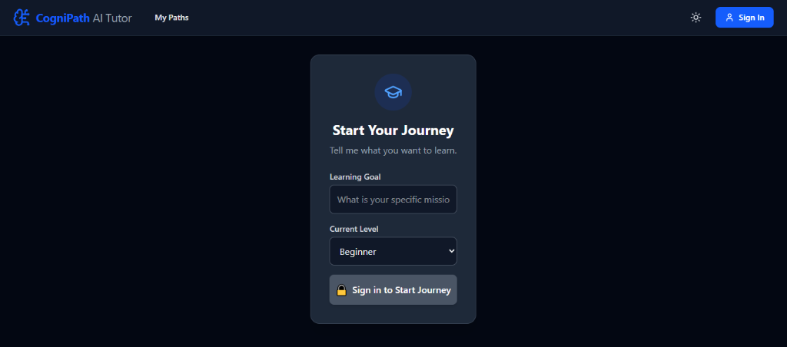
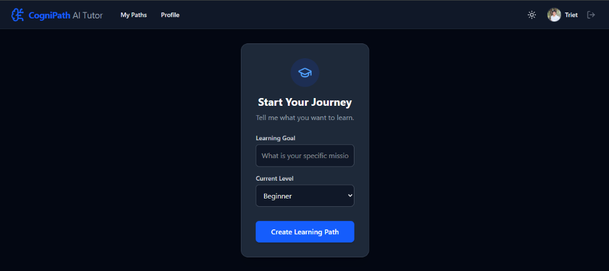
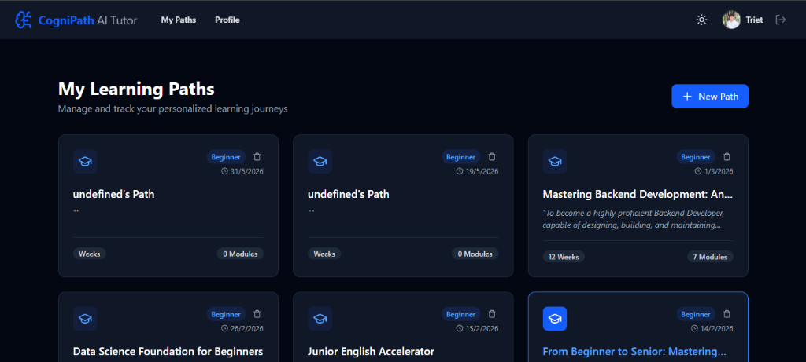
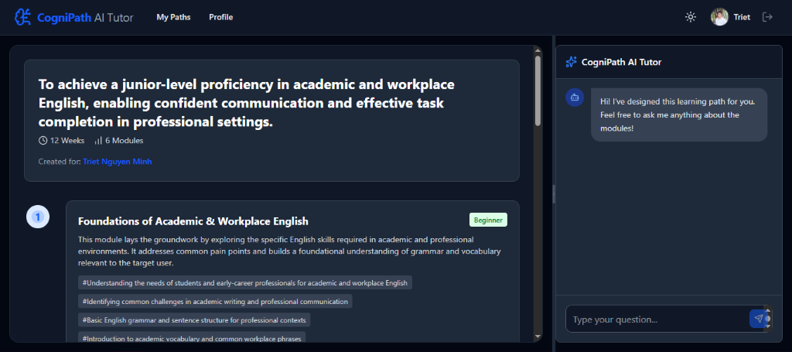
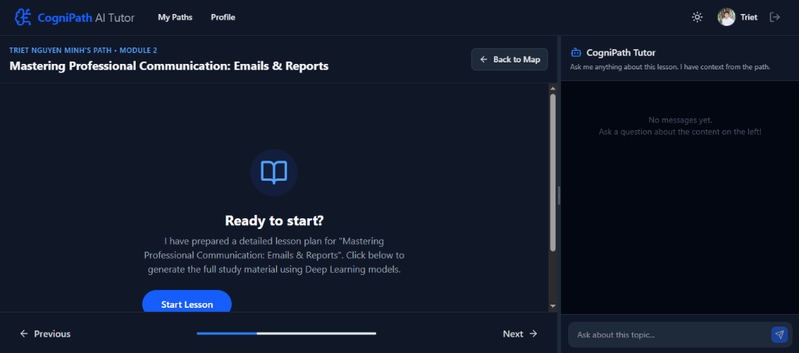

# Hướng dẫn sử dụng CogniPath LMS (Step-by-Step)

Dưới đây là tài liệu hướng dẫn chi tiết từng bước để bắt đầu hành trình học tập cá nhân hóa của bạn với hệ thống CogniPath AI Tutor.

---

### Bước 1: Khởi đầu & Đăng nhập
Khi bạn mới truy cập vào ứng dụng, hệ thống sẽ yêu cầu bạn nhập mục tiêu học tập (Learning Goal) và trình độ hiện tại (Current Level).
Tuy nhiên, để AI có thể lưu trữ và cá nhân hóa lộ trình riêng cho bạn, bạn cần phải đăng nhập.
* Tại form **Start Your Journey**, hãy điền mục tiêu của bạn (VD: "What is your specific mission").
* Chọn trình độ (VD: "Beginner").
* Bấm vào nút **Sign in to Start Journey** (có biểu tượng ổ khóa) hoặc nút **Sign In** ở góc trên cùng bên phải để đăng nhập bằng tài khoản Google.

---

### Bước 2: Khởi tạo Lộ trình học
Sau khi đăng nhập thành công (bạn sẽ thấy avatar và tên của mình - ví dụ: "Triet" ở góc phải), bạn đã sẵn sàng tạo lộ trình học.
* Lúc này, nút khóa đã chuyển thành **Create Learning Path** màu xanh.
* Hãy kiểm tra lại thông tin mục tiêu học tập của bạn.
* Bấm **Create Learning Path** để hệ thống Gemini bắt đầu phân tích và vẽ ra một giáo trình chi tiết dành riêng cho bạn.

---

### Bước 3: Quản lý Lộ trình học (Dashboard)
Tất cả các lộ trình bạn đã tạo sẽ được lưu trữ an toàn trên đám mây. Để xem lại, hãy bấm vào tab **My Paths** trên thanh điều hướng (Navbar).
* Tại đây, bạn sẽ thấy trang **My Learning Paths**.
* Các lộ trình được hiển thị dưới dạng thẻ (Card) trực quan như: *Data Science Foundation for Beginners*, *Junior English Accelerator*, v.v.
* Mỗi thẻ cung cấp thông tin tóm tắt: Trình độ (Beginner), thời gian ước tính (VD: 12 Weeks) và số lượng bài học (VD: 6 Modules).
* Bấm vào nút **+ New Path** nếu bạn muốn học thêm một kỹ năng mới.

---

### Bước 4: Khám phá Lộ trình Tổng quan
Khi bạn bấm vào một thẻ lộ trình cụ thể ở Bước 3, bạn sẽ được đưa đến màn hình **Path Visualizer**.
* **Bảng điều khiển bên trái**: Hiển thị tổng quan toàn bộ mục tiêu và danh sách các Module. Ví dụ: Module 1 *"Foundations of Academic & Workplace English"*. Mỗi Module sẽ liệt kê chi tiết các chủ đề (Topics) bạn sẽ học.
* **Cửa sổ Chat bên phải**: Trợ lý AI (CogniPath Tutor) sẽ gửi lời chào *"Hi! I've designed this learning path for you..."*. Bạn có thể bắt đầu chat ngay lập tức với trợ lý để hỏi tổng quan về toàn bộ lộ trình này. Trợ lý đã được cung cấp sẵn ngữ cảnh của toàn bộ các module.

---

### Bước 5: Bắt đầu Bài học & Tương tác chuyên sâu
Bấm vào một Module cụ thể (ví dụ: Module 2: *"Mastering Professional Communication..."*), hệ thống sẽ đưa bạn vào giao diện học chi tiết.
* **Màn hình bên trái**: Sẽ hiển thị trạng thái chờ với thông báo *"Ready to start? I have prepared a detailed lesson plan..."*.
* Bấm nút **Start Lesson** màu xanh. Lúc này, AI Engine sẽ tiến hành sinh ra toàn bộ nội dung bài giảng chi tiết, có định dạng Markdown trực quan.
* **Cửa sổ Chat bên phải**: Bây giờ sẽ chuyển sang ngữ cảnh chuyên sâu của bài học này (Local Context). Bất kỳ câu hỏi nào bạn gõ vào khung *"Type your question..."* đều sẽ được AI trả lời dựa trên chính xác nội dung bài giảng đang hiển thị bên trái.

---

Chúc bạn có một trải nghiệm học tập tuyệt vời cùng **CogniPath LMS**!
